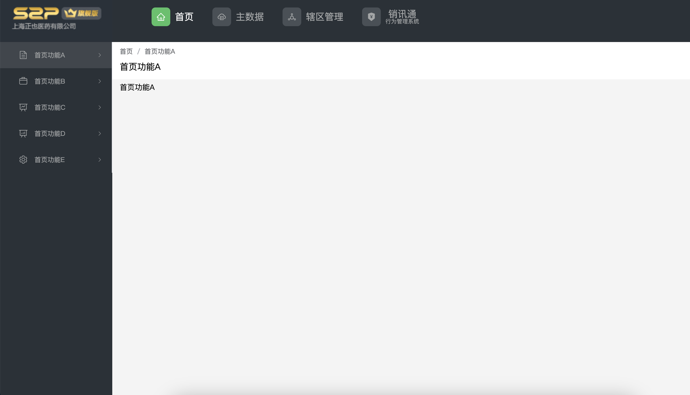
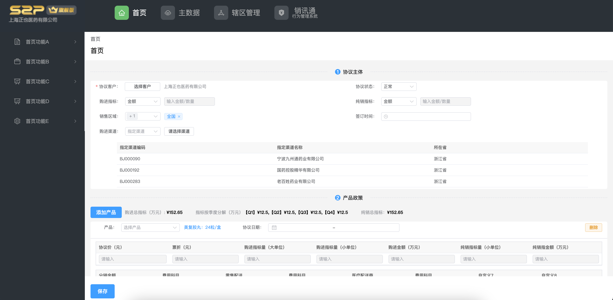
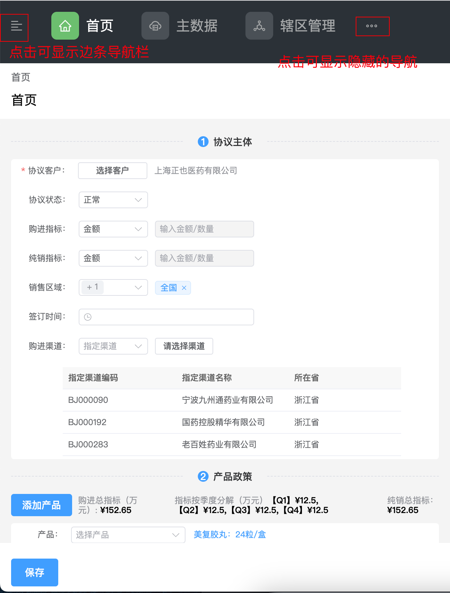
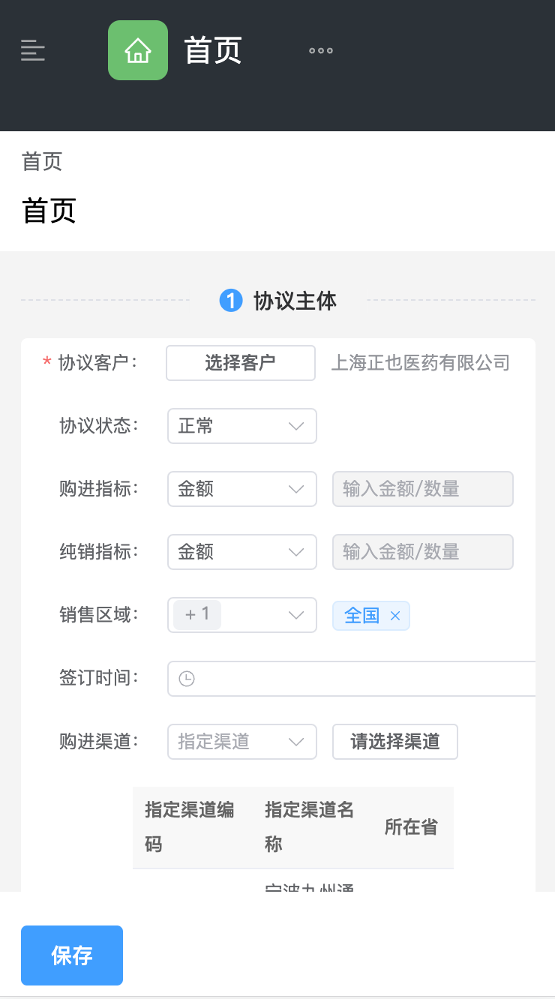

## Project Setup

```sh
pnpm install
```

### Compile and Hot-Reload for Development

```sh
pnpm dev
```

### Type-Check, Compile and Minify for Production

```sh
pnpm build
```

### Run Unit Tests with [Vitest](https://vitest.dev/)

```sh
pnpm test:unit
```

### Lint with [ESLint](https://eslint.org/)

```sh
pnpm lint
```


### 开发方案
- 使用了vue3 、vite、 typescript、 element-plus 、unocss、vue-router、postcss
- 在vite.config.js里简单配置了一下element-plus按需导入，postcss处理css兼容、打包语法降级至es6、分包合并
- 使用uncoss用来设置图标比较方便
- 添加动态的路由：边条上的导航是通过动态路由添加的，每一个导航都是顶部导航路由的独立的子路由
  - 首页下面的独立路由
  
    
  - 主数据下面的独立路由
    
- 响应式图片（只有logo用到图片）
- 利用响应式设计适配各种屏幕
    - 完整显示 
      
    - 加入过渡隐藏边条、头部导航，点击按钮可显示
      
    - 手机屏幕
      
- 0警告信息


### 目录、文件信息
  - assets - 资源目录
    - images - 项目中用到的图片资源
    - styles - 样式文件
        - animate.scss - 动画样式，空文件
        - common.scss - 全局生效的样式
        - element.scss - 全局修改element样式的文件
        - index.scss - 样式入口文件，在main.ts中导入
        - media.scss - 媒体查询文件，使用混入服用媒体查询
        - mixins.scss - scss混入文件
        - reset.scss - 样式初始化、兼容性处理，引入normalize.css
        - vars.scss - css变量文件
  - components - 全局组件
      - BreadCrumb.vue - 面包屑组件
  - hooks - 组合式api，空文件
  - layout - 布局vue文件
    - aside-layout.vue 边条导航栏组件
    - header-layout.vue 顶部header
    - index.vue - 布局文件入口
    - main-layout.vue - 主要内容文件入口，切换路由时添加了过渡效果
    - components - 布局用到的组件
  - lib - 一些通用方法集合
    - dom.ts - 操作dom的方法，未用到
    - route.ts - 添加动态路由的方法
  - router - 路由
    - index.ts - 路由配置入口文件，使用了导航守卫动态添加路由
    - menu.ts - 具体路由配置文件
  - stores - pinia store
    - layout.ts - 布局边条用到的store
    - route.ts - 动态路由store
  - views - 页面vue文件
    - home - home页面
      - menus - home页面的子路由页面
    - main-data - 主数据页面
      - menus - 主数据页面的子路由页面
    - area-management - 辖区管理页面
      - menus - 辖区管理页面的子路由页面
    - action-management - 销讯通页面
     -  menus - 销讯通页面的子路由页面
